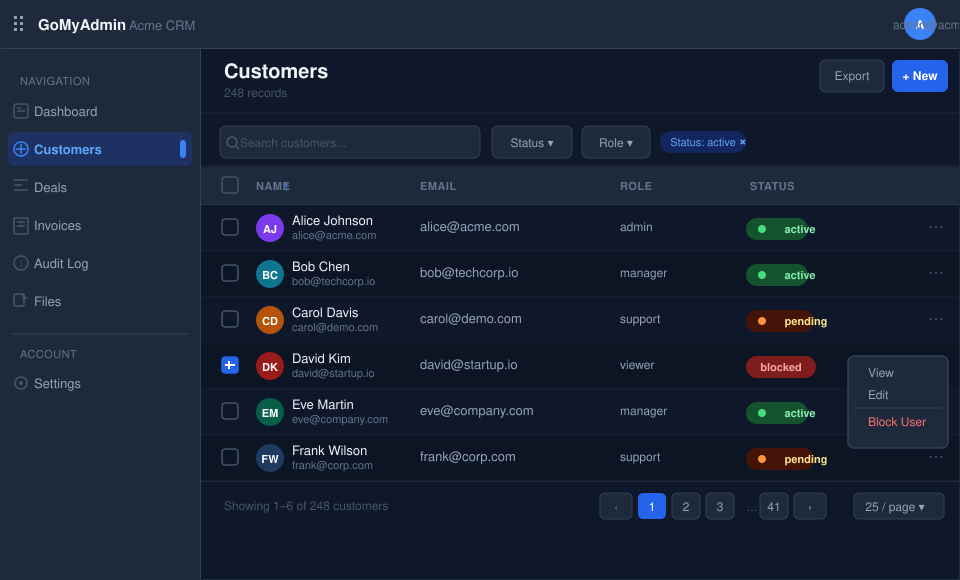

# GoMyAdmin

**The admin panel generator for Go + PostgreSQL.**  
Introspect your schema, define your resources in code, ship a production-ready Next.js backoffice in minutes.

[](https://go.dev)
[](https://www.postgresql.org)
[](LICENSE)
[](https://github.com/darwvin-dev/gomyadmin/actions/workflows/ci.yml)

<p align="center">
  <br/>
  
</p>

---

## Why

You have a Go + PostgreSQL backend. You need an admin panel. You do not want:

- a 10,000-line magic framework that fights you at every turn
- a UI rendered server-side with no TypeScript
- an admin locked to a specific ORM or HTTP router
- generated code you cannot read or commit

GoMyAdmin follows one path and makes it excellent:

```
PostgreSQL → introspect → define resources in Go → run a Next.js admin UI
```

The generated stack is **explicit Go + explicit SQL + explicit TypeScript** — no black boxes, no runtime reflection magic, no hidden query builder. Generated files are committed alongside your application code.

---

## Quick Start

```sh
# install the CLI
go install github.com/darwvin-dev/gomyadmin/cmd/gomyadmin@latest

# scaffold a new admin app
gomyadmin init my-admin --backend go --db postgres --frontend next --ui shadcn

cd my-admin
cp .env.example .env
docker compose up --build
```

Open [http://localhost:3000/admin](http://localhost:3000/admin) and log in with `admin@example.com` / `password`.

---

## Resource API

Define your admin resources in plain Go with a fluent builder:

```go
import "github.com/darwvin-dev/gomyadmin/pkg/admin"

app := admin.New("Acme Admin")

app.Resource(User{}).
    Label("Users").
    Icon("users").
    TableName("users").
    Field("ID").UUID().Primary().Readonly().
    Field("Email").Email().Required().Searchable().Sortable().Unique().
    Field("Name").String().Searchable().Sortable().
    Field("Role").Enum("admin", "manager", "support", "viewer").Filterable().
    Field("Status").Enum("active", "blocked", "pending").Filterable().Badge().
    Field("CreatedAt").DateTime().Readonly().DateRangeFilter().
    Action("Block User", blockUserHandler).Danger().RequireConfirmation().RequireReason().
    Action("Reset Password", resetPasswordHandler).RequireConfirmation().
    Audit().
    TenantScoped("tenant_id")
```

Every method returns the same type, so you chain as far as you like and your IDE autocompletes the whole thing.

---

## Features

| Feature | Notes |
|---|---|
| **PostgreSQL introspection** | Dumps your full schema to JSON in one command |
| **Code generation** | Generates readable, committable Go resource files |
| **25 field types** | string, email, password, integer, decimal, money, boolean, enum, status badge, date, datetime, uuid, json/jsonb, markdown, rich text, image, file, relation, computed |
| **Search, sort, filter** | Per-field flags; parameterized SQL, injection-safe |
| **Pagination** | `page` + `per_page`, configurable max |
| **Custom actions** | Any handler function; optional confirmation dialog, reason field, input form, timeout, permission |
| **Bulk operations** | Bulk actions and bulk delete endpoints with audit events |
| **RBAC** | 5 built-in roles (super_admin → viewer); wildcard permission matching |
| **Audit log** | Structured events with old/new values, actor, tenant, IP, request ID |
| **Multi-tenancy** | Per-resource `TenantScoped("column")` with pluggable resolver |
| **File storage** | Local filesystem + in-memory (S3-compatible interface) |
| **CSRF protection** | Double-submit cookie pattern |
| **Session management** | Secure cookie, configurable TTL, pluggable store |
| **Rate limiting** | Sliding window per IP, X-Forwarded-For aware |
| **Argon2id passwords** | Configurable memory/iterations/parallelism |
| **OpenAPI 3.1** | Generated spec for all resource endpoints and actions |
| **Docker / Compose** | Full local dev environment included |
| **CI-ready** | GitHub Actions workflow included |
| **Drop-in adapters** | Mount on existing Go backends with custom database, cache/session, auth, and storage adapters |

---

## Workflow

### 1. Introspect your existing schema

```sh
gomyadmin introspect --database-url "$DATABASE_URL" > schema.json
```

```json
{
  "tables": [
    {
      "name": "users",
      "columns": [
        { "name": "id",         "data_type": "uuid",                     "is_identity": false },
        { "name": "email",      "data_type": "character varying",         "nullable": false    },
        { "name": "created_at", "data_type": "timestamp with time zone",  "nullable": false    }
      ],
      "primary_key": ["id"]
    }
  ]
}
```

### 2a. Generate a single resource scaffold

```sh
gomyadmin generate resource User --table users
# → backend/internal/admin/user_resource.go
```

### 2b. Generate all resources from a schema in one pass

```sh
gomyadmin introspect --database-url "$DATABASE_URL" > schema.json
gomyadmin generate from-schema schema.json
# → backend/internal/admin/user_resource.go
# → backend/internal/admin/invoice_resource.go
# → backend/internal/admin/... (one file per table)
```

Column types, searchable/sortable/filterable flags, primary keys, and readonly
timestamps are all derived automatically from the schema. Pass `--force` to
overwrite files you want to regenerate.

```go
// backend/internal/admin/user_resource.go
package adminapp

import "github.com/darwvin-dev/gomyadmin/pkg/admin"

type User struct{}

func RegisterUserResource(app *admin.App) {
    app.Resource(User{}).
        Label("User").
        TableName("users").
        Field("ID").UUID().Readonly().Sortable().
        Field("Email").Email().Required().Searchable().Sortable().
        Field("CreatedAt").DateTime().Readonly().Sortable().Filterable().
        Audit()
}
```

### 3. Customize and run

Edit the generated file — add enum values, hide internal fields, wire up action handlers — then:

```sh
gomyadmin serve
# or: docker compose up --build
```

---

## CLI Reference

```sh
gomyadmin init         <name> [--backend go] [--db postgres] [--frontend next] [--ui shadcn]
gomyadmin generate     resource <Name> [--table <table>] [--package <pkg>] [--force]
gomyadmin generate     from-schema <schema.json> [--package <pkg>] [--force]
gomyadmin introspect   [--database-url <url>]
gomyadmin serve
gomyadmin dev
gomyadmin doctor
gomyadmin openapi      generate [--out openapi.json]
gomyadmin demo
gomyadmin version
```

`gomyadmin doctor` checks Go, Node.js, npm, DATABASE_URL, GOMYADMIN_SESSION_SECRET, file permissions, and PostgreSQL connectivity.

---

## Package Layout

```
cmd/gomyadmin                   CLI binary
internal/
  cli/                          command routing
  doctor/                       environment prerequisite checks
  generator/                    project scaffold + resource code generation
  introspect/                   PostgreSQL schema introspection + type mapping
pkg/
  admin/                        resource metadata API (App, Resource, Field, Action, Policy)
  auth/                         Argon2id passwords, sessions, CSRF, rate limiting
  audit/                        structured audit event contracts + in-memory store
  adapters/sqlstore/             database/sql adapter for MySQL and SQLite-style drivers
  adapters/gormstore/            GORM adapter using GORM's managed *sql.DB
  adapters/mongostore/           MongoDB adapter for document-backed resources
  adapters/redisstore/           Redis-backed admin sessions
  cache/                        tiny cache adapter contract + in-memory implementation
  filters/                      search / sort / filter query parsing
  logger/                       structured JSON logger (slog)
  migrate/                      SQL migration runner with checksum tracking
  openapi/                      OpenAPI 3.1 spec generation
  pagination/                   page + per_page parsing
  postgres/                     pgx connection pool + safe SQL query builder
  rbac/                         role-based access control + wildcard permissions
  server/                       drop-in HTTP handler; mount admin on any Go backend
  storage/                      Storage interface; local filesystem + in-memory adapters
  tenant/                       tenant context + resolver interface
templates/
  backend-go/                   runnable Go + PostgreSQL admin API template
  frontend-next-shadcn/         Next.js 16 + TypeScript + Tailwind + shadcn/ui template
examples/
  basic/                        User, Role, Post resources
  crm/                          Lead, Customer, Deal, Task, Note with tenant scoping
  postgres-crm/                 Real PostgreSQL schema + seed data for introspection
  saas/                         Organization, User, Subscription, Invoice, API Key
  sms-gateway/                  SMSMessage, Provider, Campaign, DeliveryReport
```

---

## Examples

### CRM

```go
app.Resource(Lead{}).
    Label("Leads").Icon("target").
    Field("Email").Email().Searchable().Sortable().
    Field("Source").Enum("website", "referral", "campaign").Filterable().
    Field("Status").Enum("new", "qualified", "lost").Filterable().Badge().
    Action("Assign Lead", assignLeadHandler).RequireConfirmation().
    Audit().TenantScoped("tenant_id")

app.Resource(Deal{}).
    Label("Deals").Icon("badge-dollar-sign").
    Field("Amount").Money("USD").Sortable().
    Field("Stage").Enum("open", "won", "lost").Filterable().Badge().
    Audit().TenantScoped("tenant_id")
```

### SaaS billing

```go
app.Resource(Invoice{}).
    Label("Invoices").Icon("receipt").
    Field("Amount").Money("USD").Sortable().
    Field("Status").Enum("paid", "open", "failed", "refunded").Filterable().Badge().
    Action("Refund Invoice", refundHandler).Danger().RequireReason().
    Audit().TenantScoped("tenant_id")
```

### File uploads

```go
app.Resource(Document{}).
    Label("Documents").Icon("file-text").
    Field("Title").String().Required().Searchable().
    Field("File").FileUpload().Required().
    Field("ThumbnailURL").ImageUpload().
    Audit().TenantScoped("org_id")
```

### Relation fields

```go
app.Resource(Post{}).
    Label("Posts").
    Field("AuthorID").BelongsTo(User{}).ForeignKey("author_id").Display("name").
    Field("CategoryID").BelongsTo(Category{}).ForeignKey("category_id").Display("name").
    Field("Tags").HasMany(Tag{}).
    Audit()
```

---

## Authentication & Security

GoMyAdmin ships security primitives in `pkg/auth` — wire them into your HTTP server:

```go
store   := auth.NewMemorySessionStore()
manager := auth.NewSessionManager(store)
limiter := auth.NewRateLimiter(5, time.Minute)

// login route
mux.Handle("/admin/api/login",
    limiter.Middleware(
        auth.CSRFMiddleware(loginHandler(manager)),
    ),
)

// protected routes
mux.Handle("/admin/api/", manager.Middleware(adminRouter))
```

**Password hashing** uses Argon2id with sensible defaults (64 MB, 3 iterations, 2 threads):

```go
hash, err := auth.HashPassword(plaintext, auth.PasswordConfig{})
ok, err   := auth.VerifyPassword(plaintext, hash)
```

---

## Drop-In Integration (`pkg/server`)

If you already have a Go backend, you can add a fully functional admin panel in four lines — no new project required.

### Installation

```sh
go get github.com/darwvin-dev/gomyadmin@latest
```

### Wiring it up

```go
import (
    "github.com/darwvin-dev/gomyadmin/pkg/admin"
    "github.com/darwvin-dev/gomyadmin/pkg/server"
)

// 1. Define your resources (or re-use an existing *admin.App)
app := admin.New("My App")
app.Resource(User{}).
    Label("Users").TableName("users").
    Field("ID").UUID().Primary().Readonly().
    Field("Email").Email().Required().Searchable().Sortable().
    Field("Name").String().Searchable().
    Field("Status").Enum("active", "blocked").Filterable().Badge().
    Field("CreatedAt").DateTime().Readonly().Sortable().
    Audit()

// 2. Create the admin server — it creates its own internal tables at startup
srv, err := server.New(ctx, server.Config{
    DatabaseURL:  os.Getenv("DATABASE_URL"),
    App:          app,
    Authenticate: func(ctx context.Context, email, password string) (admin.Actor, bool, error) {
        return myDB.VerifyAdminCredentials(ctx, email, password)
    },
})
if err != nil { log.Fatal(err) }
defer srv.Close()

// 3. Mount on any mux — net/http, chi, gorilla/mux, echo, …
mux.Handle("/admin/", srv.Handler())
```

That's it. The handler serves these endpoints under `/admin/api/`:

| Method | Path | Description |
|---|---|---|
| POST | `/admin/api/auth/login` | Rate-limited login; sets session cookie + CSRF token |
| POST | `/admin/api/auth/logout` | Clears session |
| GET  | `/admin/api/me` | Current actor + tenant list |
| GET  | `/admin/api/resources` | Resource metadata (fields, actions, types) |
| GET  | `/admin/api/{table}` | List with search, sort, filter, pagination |
| POST | `/admin/api/{table}` | Create |
| GET  | `/admin/api/{table}/{id}` | Fetch one |
| PATCH | `/admin/api/{table}/{id}` | Update |
| DELETE | `/admin/api/{table}/{id}` | Delete |
| POST | `/admin/api/{table}/{id}/actions/{action}` | Custom action |
| POST | `/admin/api/{table}/bulk-actions/{action}` | Bulk action |
| GET  | `/admin/api/{table}/export` | CSV export |
| GET  | `/admin/api/audit` | Audit log |
| POST | `/admin/api/files` | File upload (10 MB limit) |
| GET  | `/admin/api/files` | List uploaded files |
| GET  | `/admin/api/files/{id}` | Download file |

### Configuration

```go
server.Config{
    // Required — one of:
    DatabaseURL string          // connects and manages the pool
    Pool        *pgxpool.Pool   // use your existing pool (you close it)

    // Resource registry
    App *admin.App              // nil → empty registry

    // Authentication
    Authenticate func(ctx, email, password) (admin.Actor, bool, error)
    // nil → all logins return 401

    // Optional tenant switcher shown in the UI
    Tenants func(ctx, actor) ([]map[string]string, error)

    // File storage — defaults to local disk at UploadDir
    Uploads   storage.Storage   // set to use S3/R2/MinIO
    UploadDir string            // "tmp/uploads" by default

    // CORS / URL
    PublicURL string            // GOMYADMIN_PUBLIC_URL env var, then "http://localhost:8080"

    Log *slog.Logger            // JSON on stderr by default
}
```

### Using S3 for file uploads

```go
s3, err := storage.NewS3(storage.S3Config{
    Bucket:          "my-bucket",
    Region:          "us-east-1",
    AccessKeyID:     os.Getenv("S3_KEY"),
    SecretAccessKey: os.Getenv("S3_SECRET"),
})
srv, _ := server.New(ctx, server.Config{
    DatabaseURL: os.Getenv("DATABASE_URL"),
    App:         app,
    Uploads:     s3,
})
```

### Internal tables created at startup

`New` runs `CREATE TABLE IF NOT EXISTS` for three tables — all prefixed `gomyadmin_` to avoid conflicts with your own schema:

| Table | Purpose |
|---|---|
| `gomyadmin_sessions` | Session tokens (via `auth.PGSessionStore`) |
| `gomyadmin_audit_logs` | Admin action history |
| `gomyadmin_files` | Uploaded file metadata |

---

## PostgreSQL Stores

Both the session store and the audit store ship PostgreSQL-backed implementations alongside the built-in in-memory ones. Use the PG stores in production and the memory stores in tests.

### Session store

```go
import (
    "github.com/darwvin-dev/gomyadmin/pkg/auth"
    "github.com/jackc/pgx/v5/pgxpool"
)

pool, _ := pgxpool.New(ctx, os.Getenv("DATABASE_URL"))

store := auth.NewPGSessionStore(pool)
if err := store.Migrate(ctx); err != nil { /* … */ }   // run once at startup

manager := auth.NewSessionManager(store)
```

`PGSessionStore` stores sessions in the `gomyadmin_sessions` table (JSONB actor column, timestamptz expiry). The `Get` query filters `expires_at > NOW()` automatically, so expired rows are never returned. Call `Cleanup` on a schedule to reclaim space:

```go
deleted, err := store.Cleanup(ctx)   // deletes all expired rows, returns count
```

### Audit store

```go
import "github.com/darwvin-dev/gomyadmin/pkg/audit"

store := audit.NewPGStore(pool)
if err := store.Migrate(ctx); err != nil { /* … */ }   // run once at startup

_ = store.Record(ctx, audit.Event{
    ActorID:   actor.ID,
    TenantID:  actor.TenantID,
    Action:    "update",
    Resource:  "invoice",
    OldValues: map[string]any{"status": "open"},
    NewValues: map[string]any{"status": "paid"},
})

events, _ := store.List(ctx, audit.Query{
    TenantID: "tenant_1",
    Resource: "invoice",
    From:     time.Now().Add(-24 * time.Hour),
    Limit:    50,
})
```

`PGStore` stores events in `gomyadmin_audit_events` with four indexes (tenant, actor, resource, created_at DESC). `old_values`, `new_values`, and `metadata` are JSONB. IDs are generated with `crypto/rand`; `List` results are ordered newest-first and capped at 200 rows.

Both `Migrate` methods are idempotent (`CREATE TABLE IF NOT EXISTS`). Running them more than once is safe.

---

## RBAC

Five built-in roles with wildcard permission matching:

| Role | Permissions |
|---|---|
| `super_admin` | `*` |
| `tenant_admin` | `users.*`, `invoices.*`, `files.*`, `audit.view` |
| `manager` | `users.view`, `users.update`, `invoices.view`, `invoices.update`, `audit.view` |
| `support` | `users.view`, `invoices.view`, `audit.view` |
| `viewer` | `*.view` |

```go
authorizer := rbac.NewDefaultAuthorizer()
if !authorizer.Can(actor, "invoices.delete") {
    http.Error(w, "forbidden", http.StatusForbidden)
    return
}
```

---

## File Storage

The `storage.Storage` interface is implemented by three adapters:

```go
// local filesystem (single-node deployments)
store := storage.NewLocal("/var/data/uploads", "https://cdn.example.com")

// S3-compatible (AWS S3, Cloudflare R2, MinIO — no SDK dependency)
store, err := storage.NewS3(storage.S3Config{
    Endpoint:        "https://<accountid>.r2.cloudflarestorage.com", // omit for AWS
    Region:          "auto",
    Bucket:          "my-uploads",
    AccessKeyID:     os.Getenv("S3_ACCESS_KEY_ID"),
    SecretAccessKey: os.Getenv("S3_SECRET_ACCESS_KEY"),
    PublicBaseURL:   "https://cdn.example.com",
    ForcePathStyle:  true, // required for R2 and MinIO
})

// in-memory (tests and CI)
store := storage.NewMemory("http://localhost:8080/uploads")

// use uniformly
_ = store.Put(ctx, storage.Object{Key: "tenants/abc/avatar.png", Reader: r})
obj, _ := store.Get(ctx, "tenants/abc/avatar.png")
url, _ := store.SignedURL(ctx, "tenants/abc/avatar.png", 15*time.Minute)
```

---

## Audit Log

```go
store := audit.NewMemoryStore()

_ = store.Record(ctx, audit.Event{
    ActorID:    actor.ID,
    ActorEmail: actor.Email,
    TenantID:   actor.TenantID,
    Action:     "update",
    Resource:   "invoice",
    ResourceID: "inv_123",
    OldValues:  map[string]any{"status": "open"},
    NewValues:  map[string]any{"status": "paid"},
    IPAddress:  r.RemoteAddr,
    RequestID:  requestID,
})

events, _ := store.List(ctx, audit.Query{TenantID: "tenant_1", Resource: "invoice", Limit: 50})
```

---

## Multi-Tenancy

```go
// Resolve tenant from the authenticated actor
resolver := tenant.ActorResolver{}
t, err := resolver.Resolve(ctx, actor)

// Or use a fixed tenant for single-tenant apps
resolver := tenant.StaticResolver{Tenant: tenant.Tenant{ID: "main", Name: "Acme"}}
```

Resources declared with `.TenantScoped("tenant_id")` automatically scope all SQL queries to the resolved tenant.

---

## OpenAPI

```sh
gomyadmin openapi generate --out openapi.json
```

Or generate programmatically:

```go
spec := openapi.Generate(app, "1.0.0")
data, _ := openapi.JSON(spec)
os.WriteFile("openapi.json", data, 0644)
```

---

## Running the Demo

```sh
git clone https://github.com/darwvin-dev/gomyadmin
cd gomyadmin
make demo
# → docker compose up --build
```

Open [http://localhost:3000/admin](http://localhost:3000/admin) → `admin@example.com` / `password`

The demo backend includes users, customers, invoices, invoice items, payments, tickets, audit logs, and file attachments, all backed by a real PostgreSQL database.

---

## More Guides

- [Authentication and sessions](docs/auth.md)
- [Stable CLI init flow](docs/cli-init.md)
- [Drop-in adapters for existing Go backends](docs/drop-in-adapters.md)
- [Compatibility policy](docs/compatibility.md)
- [Versioned migrations](docs/migrations.md)
- [PostgreSQL CRM schema example](examples/postgres-crm/README.md)

---

## Verification

```sh
go test ./...
go vet ./...
```

```sh
cd templates/frontend-next-shadcn
npm ci
npm run typecheck
npm run build
```

---

## Stack

| Layer | Technology |
|---|---|
| Language | Go 1.23 |
| Database | PostgreSQL 17 via pgx v5 |
| HTTP router | chi v5 |
| Frontend | Next.js 16, React 19, TypeScript |
| UI | Tailwind CSS + shadcn/ui (Radix primitives) |
| Tables | TanStack Table |
| Data fetching | TanStack Query |
| Forms | React Hook Form + Zod |

---

## Roadmap

- [x] Resource metadata API with full field/action/policy builder
- [x] PostgreSQL introspection + column-to-field-type mapping
- [x] Code generation (project scaffold + per-resource files)
- [x] Safe parameterized SQL query builder (search, sort, filter, pagination)
- [x] Argon2id passwords, sessions, CSRF, rate limiting
- [x] RBAC with wildcard permission matching
- [x] Audit log contracts + in-memory store
- [x] Local filesystem + in-memory storage adapters
- [x] OpenAPI 3.1 spec generation
- [x] Multi-tenancy with pluggable resolver
- [x] PostgreSQL-backed session and audit stores
- [x] S3 / R2 storage adapter
- [x] `gomyadmin generate from-schema` — reads `schema.json` and produces resource files in one pass
- [x] `pkg/server` — drop-in HTTP handler; mount an admin panel on any existing Go backend in 4 lines
- [x] Stable `gomyadmin init` flow with migrations, seed data, and Next.js starter UI
- [x] Public adapter interface for custom databases, ORMs, caches, sessions, auth, and storage
- [x] Generic `pkg/cache` interface for Redis/Memcached/application-cache adapters
- [x] `database/sql` adapter for MySQL and SQLite-style drivers
- [x] GORM, MongoDB, and Redis session adapters
- [x] Production-oriented SQL migration runner with checksum tracking
- [ ] Relation field rendering in the frontend
- [ ] Playwright e2e tests for the CRM demo

---

## Contributing

See [CONTRIBUTING.md](CONTRIBUTING.md). Short version:

```sh
cp .env.example .env
make demo          # spin up the full stack
go test ./...      # run all Go tests
go vet ./...       # static analysis
```

Open small, focused pull requests with a clear problem statement and failing test when applicable. Security-sensitive changes always need failure-mode tests.

---

## License

[MIT](LICENSE)
